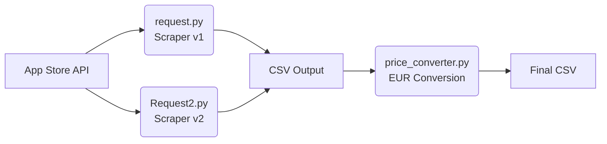

<div align="center">

[](https://github.com/Sofian-bll/AppStore-Scraper/blob/main/LICENSE)
[](https://github.com/Sofian-bll/AppStore-Scraper/releases)
[](https://github.com/Sofian-bll/AppStore-Scraper/stargazers)

<p align="center">
  
</p>

<a id="readme-top"></a>
<h1 align="center">App Store Price Scraper</h1>

<p align="center">Collect and analyze in-app purchase prices from Apple's App Store across 36 countries and 30+ currencies — with real-time EUR conversion.</p>

<p align="center">🇬🇧 <a href="README.md"><b>English</b></a> · 🇫🇷 <a href="README.fr.md">Français</a></p>

[Explore docs](docs/) · [Report Bug](https://github.com/Sofian-bll/AppStore-Scraper/issues) · [Request Feature](https://github.com/Sofian-bll/AppStore-Scraper/issues)

</div>

<details open>
  <summary>Table of Contents</summary>
  <ol>
    <li><a href="#what-is-this">What is this?</a></li>
    <li><a href="#how-it-works">How It Works</a></li>
    <li><a href="#built-with">Built With</a></li>
    <li><a href="#quick-start">Quick Start</a></li>
    <li><a href="#project-structure">Project Structure</a></li>
    <li><a href="#documentation">Documentation</a></li>
    <li><a href="#project-evolution">Project Evolution</a></li>
    <li><a href="#configuration">Configuration</a></li>
    <li><a href="#output-format">Output Format</a></li>
    <li><a href="#contributing">Contributing</a></li>
    <li><a href="#author">Author</a></li>
    <li><a href="#license">License</a></li>
  </ol>
</details>

## What is this?

A Python tool that scrapes in-app purchase pricing data from Apple's App Store API for any app, across 36 countries. It exports structured CSV data and includes real-time currency conversion to euros via the Exchange Rate API.

> Built during my 2nd week of learning Python — from hand-coded prototype to AI-assisted multi-layer tool.

<p align="right">(<a href="#readme-top">back to top</a>)</p>

## How It Works



<p align="right">(<a href="#readme-top">back to top</a>)</p>

## Built With

- [![Python][python-shield]](https://www.python.org/) — Core language
- [![Pandas][pandas-shield]](https://pandas.pydata.org/) — Data manipulation and CSV export
- [![Requests][requests-shield]](https://requests.readthedocs.io/) — HTTP client for App Store API
- [![API][api-shield]](https://www.exchangerate-api.com/) — Real-time currency conversion

<p align="right">(<a href="#readme-top">back to top</a>)</p>

## Quick Start

```bash
# Install dependencies
pip install -r requirements.txt

# Scrape in-app purchases for 36 countries (edit app_id in Request2.py)
python Request2.py

# Convert prices to euros
python price_converter.py
```

<p align="right">(<a href="#readme-top">back to top</a>)</p>

## Project Structure

```
.
├── App Price/              # Output CSV data
│   ├── Chat-Gpt Price.csv
│   ├── Claude Price.csv
│   └── Raycast Price.csv
├── docs/                   # Documentation and landing page
│   └── assets/
│       └── logo.png
├── LICENSE
├── README.md
├── README.fr.md
├── Request2.py             # Enhanced multi-country scraper (v2)
├── price_converter.py      # Currency conversion to EUR
├── request.py              # Original single-country scraper (v1)
└── requirements.txt
```

<p align="right">(<a href="#readme-top">back to top</a>)</p>

## Documentation

| File | Description |
|------|-------------|
| [`request.py`](request.py) | Original v1 — single-country scraper with console output. Hand-coded from scratch. |
| [`Request2.py`](Request2.py) | Enhanced v2 — 36 countries, CSV export, real-time progress bar. AI-assisted with human directives. |
| [`price_converter.py`](price_converter.py) | Currency conversion to EUR with live exchange rates and caching. AI-assisted with human directives. |

<p align="right">(<a href="#readme-top">back to top</a>)</p>

## Project Evolution

1. **V1** (`request.py`) — Original script, hand-coded entirely by the author
2. **V2** (`Request2.py`) — Major improvements with AI guidance: multi-country, CSV export, progress tracking
3. **Extension** (`price_converter.py`) — Currency conversion layer added with AI assistance

<p align="right">(<a href="#readme-top">back to top</a>)</p>

## Configuration

| Variable | File | Line | Description |
|----------|------|------|-------------|
| `app_id` | `Request2.py` | 37 | Target app ID to scrape |
| `country_codes` | `Request2.py` | 38-42 | Countries to query |
| `to_currency` | `price_converter.py` | – | Target currency (default: EUR) |

<p align="right">(<a href="#readme-top">back to top</a>)</p>

## Output Format

| Column | Source | Description |
|--------|--------|-------------|
| `country` | `Request2.py` | Country name |
| `name` | `Request2.py` | Product name |
| `price` | `Request2.py` | Raw price (numeric) |
| `price_formatted` | `Request2.py` | Formatted price (e.g. `$4.99`) |
| `currency` | `Request2.py` | Currency code (e.g. `USD`) |
| `price_eur` | `price_converter.py` | Price converted to EUR |

<p align="right">(<a href="#readme-top">back to top</a>)</p>

## Contributing

Contributions are welcome. Open an issue to discuss what you'd like to change, or submit a pull request directly.

<a href="https://github.com/Sofian-bll/AppStore-Scraper/graphs/contributors">
  
</a>

<p align="right">(<a href="#readme-top">back to top</a>)</p>

## Author

- **Original script** (`request.py`): Developed entirely by hand
- **Enhancements** (`Request2.py`, `price_converter.py`): Developed with AI assistance and human directives

<p align="right">(<a href="#readme-top">back to top</a>)</p>

## License

MIT — see [LICENSE](LICENSE) for details.

<p align="right">(<a href="#readme-top">back to top</a>)</p>

---

<div align="center">

[](https://star-history.com/#Sofian-bll/AppStore-Scraper&Date)

</div>

<!-- REFERENCE LINKS -->
[python-shield]: https://img.shields.io/badge/python-3670A0?style=flat&logo=python&logoColor=ffdd54
[pandas-shield]: https://img.shields.io/badge/pandas-%23150458.svg?style=flat&logo=pandas&logoColor=white
[requests-shield]: https://img.shields.io/badge/requests-%23000000.svg?style=flat&logo=python&logoColor=white
[api-shield]: https://img.shields.io/badge/API-%23FF6B6B.svg?style=flat&logo=fastapi&logoColor=white
